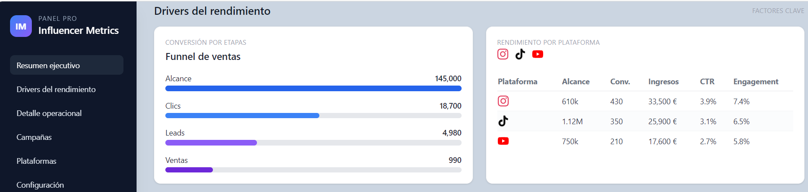

# Dashboard Frontend - Influencer Performance

Frontend de un dashboard profesional para consolidar metricas de rendimiento de anuncios y productos en multiples plataformas.

## Preview



Guarda la captura del dashboard en esta ruta para que se muestre en GitHub:

assets/dashboard-preview.png

## Vista general

Este proyecto muestra un panel administrativo en una sola pagina con:

1. Resumen ejecutivo con KPIs clave.
2. Drivers del rendimiento (funnel, calidad, plataformas, actividad y engagement).
3. Detalle operacional con tablas, filtros visuales y alertas.

## Tecnologias

1. HTML5
2. Tailwind CSS por CDN
3. Flask (solo para levantar servidor local)

CDN utilizado en la pagina:

```html
<script src="https://cdn.tailwindcss.com"></script>
```

## Estructura del proyecto

1. `index.html`: interfaz completa del dashboard.
2. `server.py`: servidor local para previsualizar el proyecto.
3. `learn.json`: metadata del ejercicio.

## Como ejecutar en local

1. Instala dependencias:

```bash
pip3 install flask
```

2. Inicia el servidor:

```bash
python3 server.py
```

3. Abre en el navegador:

```text
http://127.0.0.1:3000
```

## Secciones de la interfaz

1. Sidebar con navegacion y estado del periodo.
2. Navbar superior con accion de exportar reporte.
3. Bloque de KPIs en tarjetas responsivas.
4. Paneles intermedios de analisis por driver.
5. Tablas operacionales de productos, plataformas y campanas.
6. Alertas de negocio y filtros visuales simulados.

## Datos y contexto de negocio

1. Productos de ejemplo:
   Producto A: 50 EUR
   Producto B: 120 EUR
   Producto C: 80 EUR
2. Comision aplicada: 15% por venta.
3. Plataformas incluidas: Instagram, TikTok y YouTube.
4. Los valores son datos dummy coherentes para demo.

## Responsive design

El dashboard esta construido con grid y utilidades Tailwind para adaptarse a:

1. Movil (una columna principal)
2. Tablet (distribucion intermedia)
3. Desktop (layout admin con sidebar fija)

## Personalizacion rapida

1. Cambia colores globales editando clases Tailwind en `body`, `aside` y tarjetas.
2. Ajusta metricas directamente en `index.html` para conectar con tus reportes reales.
3. Sustituye iconos y textos para adaptar el panel a tu marca personal.

## Estado del proyecto

Version inicial funcional del frontend completada y lista para evolucionar hacia una integracion con datos reales (API o JSON).
